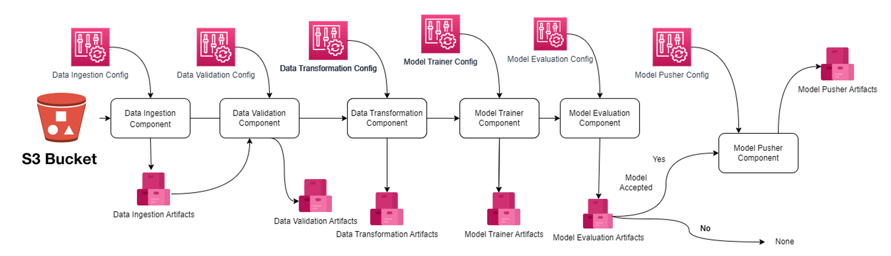

## Problem Statement
The Air Pressure System (APS) is a critical component of a heavy-duty vehicle that uses compressed air to force a piston to provide pressure to the brake pads, slowing the vehicle down. The benefits of using an APS instead of a hydraulic system are the easy availability and long-term sustainability of natural air.

This is a Binary Classification problem, in which the affirmative class indicates that the failure was caused by a certain component of the APS, while the negative class indicates that the failure was caused by something else.

## Solution Proposed
In this project, the system in focus is the Air Pressure system (APS) which generates pressurized air that are utilized in various functions in a truck, such as braking and gear changes. The datasets positive class corresponds to component failures for a specific component of the APS system. The negative class corresponds to trucks with failures for components not related to the APS system.

The problem is to reduce the cost due to unnecessary repairs. So it is required to minimize the false predictions.

## Sensor Fault Detection Architecture


## Sensor Fault Detection Training Pipeline 


## Deploymnet
- 1- Login to AWS console
- 2- Create IAM user for deploymnet with specific access
```bash
EC2 access: It is virtual machine

S3 bucket: To store artifacts and model is s3 bucket

ECR: Elastic Container Registry to save docker image in aws
```
- 3- Create S3 bucket: 
```bash 
sensor-fault-training-pipeline
```
- 4- Create ECR repo : 
```bash
607841237944.dkr.ecr.us-east-2.amazonaws.com/sensor-faualt-detection
```
- 5- Create EC2 instance: ubuntu
- 6- Install docker in EC2 instance
```bash
#optinal

sudo apt-get update -y

sudo apt-get upgrade

#required

curl -fsSL https://get.docker.com -o get-docker.sh

sudo sh get-docker.sh

sudo usermod -aG docker ubuntu

newgrp docker
```
- 7- Configure EC2 as self-hosted runner
```bash
github: setting>actions>runner>new self-hosted runner>chosse os> then run command one by one
``` 
- 8- Setup github secrets
```bash
AWS_ACCESS_KEY_ID: #########
AWS_SECRET_ACCESS_KEY: #########
AWS_REGION: us-east-2
AWS_ECR_LOGIN_URI: 607841237944.dkr.ecr.us-east-2.amazonaws.com
ECR_REPOSITORY_NAME: sensor-faualt-detection
```


## Policy
- 1- AmazonEC2ContainerRegistryFullAccess
- 2- AmazonEC2FullAccess
- 3- AmazonS3FullAccess

## Description about deployment
- 1- Build docker image of the source code
- 2- Push your docker image to ECR
- 3- Launch EC2 instance
- 4- Pull your image from ECR in EC2 instance
- 5- Launch your docker image in EC2 instance


